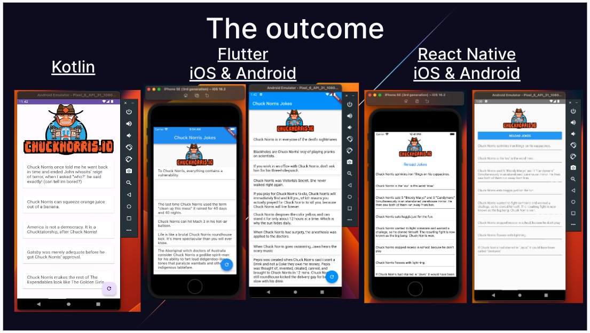

# Chuck Norris Jokes App

## Introduction
This repository contains three different implementations of the Chuck Norris Jokes app using different technologies: Kotlin, React Native, and Flutter. The purpose of this project is to compare and showcase the development experience and capabilities of each technology.

## Purpose
The Chuck Norris Jokes app fetches jokes from the Chuck Norris jokes API and displays them in a scrollable list. Each joke is presented in a card format. The app allows fetching new jokes on-demand and limits the display to a maximum of 10 jokes at a time.

## How to Run the React Native App
To run the React Native app, follow these steps:

1. Ensure you have Node.js and npm installed on your machine.

2. Open a terminal and navigate to the `react-native-app` directory.

3. Run the following command to install the dependencies: `npm install`

4. Connect a device or start an emulator.

5. Run the following command to start the app on your device or emulator: `npx react-native run-android` / `npx react-native run-ios`

## How to Run the Kotlin App
To run the Kotlin app, follow these steps:

1. Open the project in Android Studio.

2. Make sure you have the necessary Android SDK and emulator set up.

3. Build the project to resolve any dependencies.

4. Run the app on a connected device or emulator.

## How to Run the Flutter App
To run the Flutter app, follow these steps:

1. Ensure you have Flutter SDK installed on your machine.

2. Open a terminal and navigate to the `flutter-app` directory.

3. Run the following command to fetch the dependencies: `flutter pub get`

4. Run the following command to get the app on a device or emulator: `flutter run -d <device_id>`

## Conclusions
The purpose of this project is to compare the development experience and capabilities of Kotlin, React Native, and Flutter.

Kotlin development was effortless once I abandoned trying to have ChatGPT explain to me that I should be implementing the project using Kotlin 1.4.3
Importing images and creating the reload button I desired was easy using the resource manager in Android Studio.
Kotlin clearly isn’t as supported as Java by ChatGPT, this is perhaps due to the age of the language?

I thought the setup of Flutter was fairly effortless as it has something called the Flutter doctor. I found the setup doc’s to be a little confusing so I ended up watching a Youtube video to help setup the remaining bits for Android. A word of caution, don’t ask ChatGPT to explain to you how to setup your Flutter development environment.
Something which I thought was cool was that the Flutter UI looked the most Native out of the box. By default I could refresh the list using the circular button in the bottom right, which I didn’t need to setup, it was just there, and I could drag down on the screen to refresh. This was also really cool as I didn’t ask for the functionality.

React Native looks bad out-of-the-box. From personal experience I know I would have to tweak the code and add a few more lines to get it to look similar to the other two screenshots.

## ChatGPT limitations

- Lack of real-time updates: ChatGPT's training data has a cutoff date, which means it lacks knowledge of events or developments that occurred after its last training update (September 2021). Therefore, it may not provide the most up-to-date information on current events, recent research, or evolving topics.
- Difficulty handling ambiguous queries: When faced with ambiguous queries or incomplete information, ChatGPT may make assumptions or guess the user's intent. These assumptions may not align with the user's actual question or context, leading to inaccurate or irrelevant responses.
- Lack of personal experience and emotions: ChatGPT does not possess personal experiences or emotions. It does not have memory of previous interactions within a conversation, so each user turn is treated as an isolated prompt. It may not remember information shared earlier in the conversation, requiring users to repeat or provide additional context.

